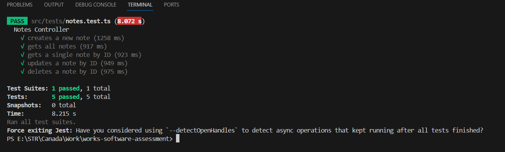

---

# Note-App Backend 

This is a simple note-taking backend application built with TypeScript, Express.js, and MongoDB. It allows users to create, read, update, and delete notes.

## Features

- Create a new note with a folder, title and content.
- View all existing notes.
- View a single note by its ID.
- Update an existing note by its ID.
- Delete a note by its ID.


## Approach

The project follows a structured approach to ensure scalability, maintainability, and ease of development. Here's an overview of the approach followed:

1. **Modular Architecture**: The project is organized into modular components, including controllers, models, routes, and tests. This modular structure allows for better separation of concerns and easier code maintenance.

2. **TypeScript**: TypeScript is used for static typing, providing enhanced code quality, better documentation, and improved developer experience.

3. **Express.js**: Express.js is used as the web application framework for handling HTTP requests, routing, middleware, and serving static files.

4. **MongoDB**: MongoDB is used as the NoSQL database to store notes. Mongoose is used as an ODM (Object Data Modeling) library to interact with the MongoDB database.

5. **Testing**: Jest is used as the testing framework for writing and executing tests. Unit tests are written to ensure the correctness of individual components, including controllers, models, and routes.

## Project Structure

The project follows a structured organization to maintain clarity and consistency. Here's an overview of the project structure:

```
note-app/
├── src/
│   ├── controllers/         # Controllers for handling HTTP requests
│   ├── configs/             # Configurations for connecting to the DB
│   ├── models/              # Mongoose models for defining MongoDB schemas
│   ├── routes/              # Express.js routes for defining API endpoints
│   ├── tests/               # Unit tests for testing controllers, models, and routes
│   └── index.ts            # Entry point for the Express.js application
├── .env.example             # Example environment variables file
├── .gitignore               # Git ignore file
├── package.json             # Node.js dependencies and scripts
├── tsconfig.json            # TypeScript configuration file
└── README.md                # Project documentation
```

- **controllers/**: Contains controllers responsible for handling HTTP requests and sending responses. Each controller corresponds to a specific route or set of routes.

- **models/**: Contains Mongoose models for defining MongoDB schemas. Each model represents a collection in the MongoDB database and includes methods for interacting with the data.

- **configs/**: Contains Configuration variables for establishing a connection with MongoDB .

- **routes/**: Contains Express.js routes for defining API endpoints. Each route file defines routes for a specific resource or feature of the application.

- **tests/**: Contains unit tests written using Jest for testing controllers, models, and routes. Each test file corresponds to a specific component or functionality and includes test cases to verify its behavior.

- **index.ts**: Entry point for the Express.js application. Initializes the Express.js server, middleware, routes, and connects to the MongoDB database.

- **.env.example**: Example environment variables file with placeholders for MongoDB URI and other configuration variables.

- **.gitignore**: Specifies files and directories to be ignored by Git version control.

- **package.json**: Contains Node.js dependencies and scripts for running the application, tests, and other development tasks.

- **tsconfig.json**: TypeScript configuration file specifying compiler options and project settings.

- **README.md**: Project documentation file containing an overview of the application, instructions for setup, usage, and other relevant information.

## Challenges Faced

### Understanding TypeScript

- **Challenge**: Getting familiar with TypeScript's syntax and concepts. I used to work in JavaScript.
- **Solution**: Invested time in reading TypeScript documentation, youtube tutorials, and practical examples to know key concepts such as type annotations, interfaces, and generics.

### Configuring TypeScript

- **Challenge**: Configuring TypeScript in the project and understanding tsconfig.json settings.
- **Solution**: Used LLMs for understanding the current tsconfig.json. Went through youtube tutorials & documentation for understanding the settings used in it.
Updated the config file with the below code, for including the directories while compiling the script.

    ```json
        "include": ["src/**/*", "jest.config.ts"]
    ```
### Writing Test Cases with Jest

- **Challenge**: Writing effective test cases using Jest for the controllers.
- **Solution**: Faced challenges in setting up mocks, understanding asynchronous testing, and structuring test suites. Went through Jest documentation, online tutorials and LLMs to learn best practices and overcome obstacles. Refactored test cases iteratively to improve readability, maintainability, and coverage.


## Installation

1. Clone the repository:

   ```bash
   git clone https://github.com/shiftkey-labs/works-software-assessment.git
   ```

2. Install dependencies:

   ```bash
   cd works-software-assessment
   npm install
   ```

3. Set up environment variables:

   Create a `.env` file in the root directory of the project and define the following variables:

   ```plaintext
   MONGO_URI=<your-mongodb-uri>
   MONGO_URI_TEST=<your-mongodb-test-uri>
   ```
   

   Replace `<your-mongodb-uri>` &  `<your-mongodb-test-uri>`(for testing the controllers) with your MongoDB connection URI.

4. Start the server:

   ```bash
   npm run dev
   ```

   The server will start at `http://localhost:5000` by default.

## Usage

- Use a tool like Postman or cURL to interact with the API endpoints.
- Refer to the API documentation below for details on each endpoint.

## API Documentation

### Create a Note

- **URL:** `/api/notes`
- **Method:** `POST`
- **Request Body:**

  ```json
  {
    "folder":"Coursework",
    "title": "CSCI 5308",
    "content": "Day 1 : Git and VCS"
  }
  ```

- **Response:** Newly created note object.

    ```json
    {
        "folder": "Coursework",
        "title": "CSCI 5308",
        "content": "Day 1 : Git and VCS",
        "updatedAt": null,
        "_id": "660f27a52d328fb8fe6966a5",
        "createdAt": "2024-04-04T22:20:21.840Z",
        "__v": 0
    }

    ```
  
### Get All Notes

- **URL:** `/api/notes`
- **Method:** `GET`
- **Response:** Array of all notes.

### Get Note by ID

- **URL:** `/api/notes/:id`
- **Example:**  `/api/notes/660f27a52d328fb8fe6966a5`
- **Method:** `GET`
- **Response:** Note object with the specified ID.
    ```json
        {
            "folder": "Coursework",
            "title": "CSCI 5308",
            "content": "Day 1 : Git and VCS",
            "updatedAt": null,
            "_id": "660f27a52d328fb8fe6966a5",
            "createdAt": "2024-04-04T22:20:21.840Z",
            "__v": 0
        }
    ```
    
   
### Update Note by ID

- **URL:** `/api/notes/:id`
- **Example:**  `/api/notes/660f27a52d328fb8fe6966a5`
- **Method:** `PUT`
- **Request Body:** Updated Changes

  ```json
  {
    "folder":"Coursework",
    "title": "CSCI 5308",
    "content": "Day 1 : Git and Version Control Sytem"
  }
  ```

- **Response:** Updated note object.

    ```json
    {
    "_id": "660f27a52d328fb8fe6966a5",
    "folder": "Coursework",
    "title": "CSCI 5308",
    "content": "Day 1 : Git and Version Control System",
    "updatedAt": "2024-04-04T22:26:56.921Z",
    "createdAt": "2024-04-04T22:20:21.840Z",
    "__v": 0
    }
    ```
    

### Delete Note by ID

- **URL:** `/api/notes/:id`
- **Example:**  `/api/notes/660f27a52d328fb8fe6966a5`
- **Method:** `DELETE`
- **Response:** Success message.
    ```json
    {
        "message": "Note deleted successfully"
    }
    ```
    
    
## Tests
  Running the test cases for the controller components

   ```bash
   npx jest
   ```

Test cases have been written for all the API endpoints using jest

   


